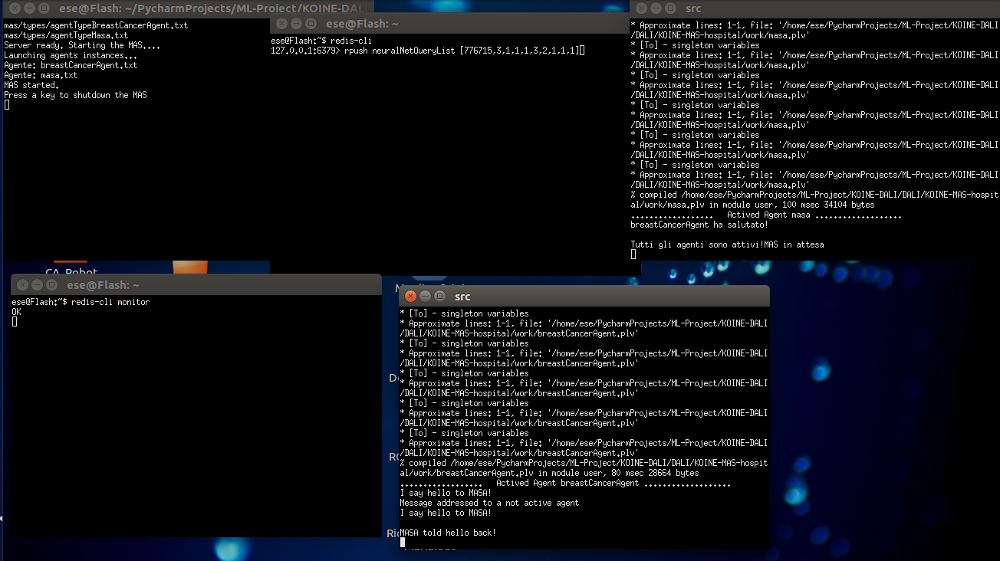
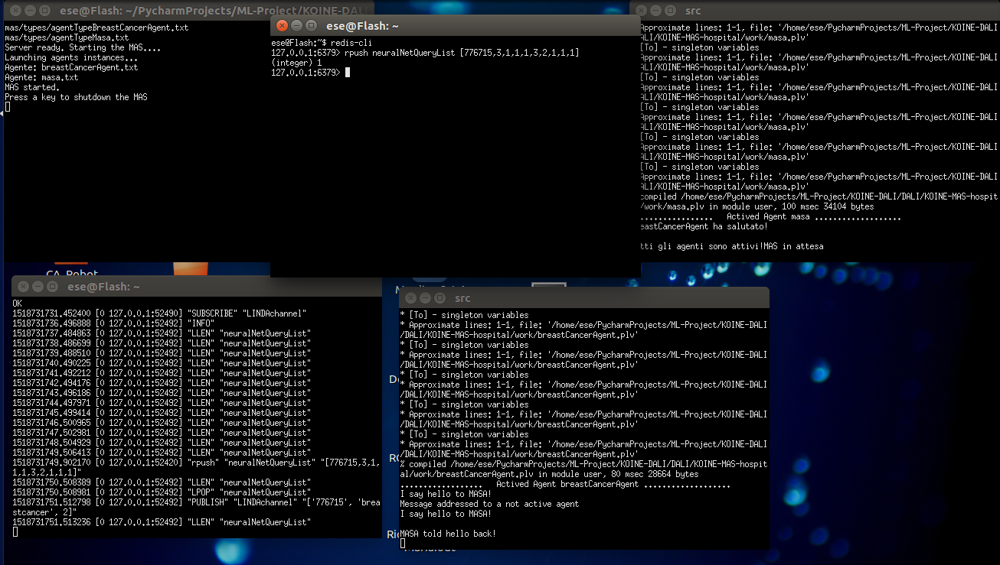
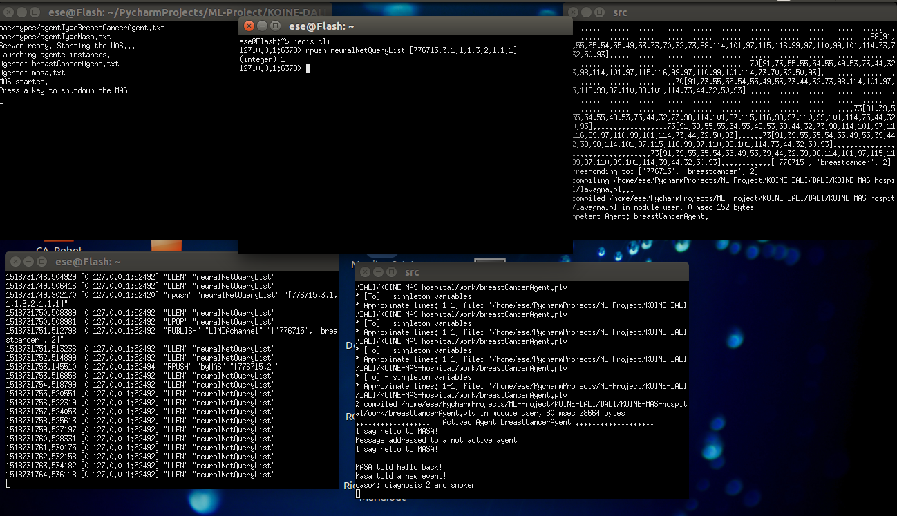

# NeuralMAS
> Neural Network and Multi-Agent System Hybrid Framework.

NeuralMAS is composed of a Koinè-DALI MAS, a Keras Neural Network and NeuralRedis, a module I made to manage Redis and the Dataset, so that the Dataset can be easily changed with another one.

## The Neural Network
The Neural Network has been developed using Keras library, running on top of TensorFlow.
See: 
- https://keras.io/
- https://www.tensorflow.org/

Keras is very powerful and can run on top of Theano or CNTK too, but you can use a different technology of your choise insted of it.

## The Multi-Agent System
The Multi-Agent System (MAS) has been developed using DALI, or better Koinè DALI, running on top of SICStus Prolog.
See: 
- https://github.com/agnsal/KOINE-DALI
- https://github.com/AAAI-DISIM-UnivAQ/DALI
- https://sicstus.sics.se/
You can choose to develop the MAS with a different technology instead of it.

## The Communication
The communication channel between the Neural Network and the MAS is made using Redis.
See:
- https://redis.io/

## The Environment
You can use it on both Linux and Windows, and it is compatible with Docker too (so you can use it on distributed Systems too):
See:
- https://github.com/agnsal/docker-PyRedis
- https://www.docker.com/

## Instructions
1. To install Redis see: https://redis.io/
2. To install Keras and Tensorflow see: https://keras.io/ and https://www.tensorflow.org/
3. To install SISCtus Prolog see: https://sicstus.sics.se/
4. To install numpy and Keras dependencies:
```sh
  sudo pip3 install h5py
  sudo pip3 install numpy
```
5. To get NeuralMas:
```sh
  git clone https://github.com/agnsal/NeuralMAS.git
```
6. To get KOINE-DALI and its dependencies and include it in this project: 
```sh
  cd NeuralMAS
  git clone https://github.com/agnsal/KOINE-DALI.git
  git clone https://github.com/agnsal/KOINE-DALI.git
  cd KOINE-DALI/DALI
  git clone https://github.com/AAAI-DISIM-UnivAQ/DALI.git
  mv DALI/* .
  rm -rf DALI
  cp -r KOINE-MAS-example KOINE-MAS-hospital
  rm -rf KOINE-MAS-hospital/mas
  mv ../../mas KOINE-MAS-hospital/
```
7. To join the trained net file pieces and decompress it:
```sh
  cd ../../
  cat LetterNet.h5* > LetterNet.h5.tar.gz
  tar -xvzf LetterNet.h5.tar.gz
```
8. To start the MAS:
```sh
  cd KOINE-DALI/DALI/KOINE-MAS-hospital/conf
  chmod u+rx makeconf.sh
  chmod u+rx startagent.sh
  cd ..
  sudo bash startmas.sh  # Or sudo bash startmasMary.sh if you prefer a single window MAS
```
The agents will say when they finish the handshake.

9. Open another terminal to monitor Redis:
```sh
  redis-cli monitor
```
10. To open the communication channel between the Neural Net and the MAS:
```sh
  cd ../../
  python3 Redis2LINDA.py
```
11. To start the Neural Net:
```sh
  cd ../
  python3 BreastCancerNet.py
```
12. In another terminal, to make some queries, about the dataset (for example):
```sh
  redis-cli
  rpush neuralNetQueryList [776715,3,1,1,1,3,2,1,1,1]
  rpush neuralNetQueryList [897471,4,8,8,5,4,5,10,4,1]
```
and so on.
You can see the data obtained by the Net and by the MAS via the Redis monitor.

13. To stop the MAS just press a button.

## Screenshots:




